


 

 



Sou fundador da **[Mutagex](https://github.com/Mutagex-lab)**, estúdio de software sediado em Boituva/SP. Conduzo o desenvolvimento dos produtos próprios do estúdio e de projetos sob medida para empresas, da definição do problema até o sistema em produção.

Minha frente principal é automação com IA: agentes de atendimento e pré-venda no WhatsApp e no Instagram, integrações entre sistemas e fluxos em n8n que eliminam trabalho manual e repetitivo nas operações dos clientes.

 



 


<a href="https://dominifin-app.vercel.app"></a>
<a href="https://leadward.vercel.app"></a>
<a href="https://www.mutagex.com/automacao"></a>
<a href="https://www.mutagex.com"></a>

 



 


<picture>
  <source media="(prefers-color-scheme: dark)" srcset="https://raw.githubusercontent.com/Amor-im/Amor-im/output/snake-dark.svg">
  
</picture>

A maior parte do trabalho está em repositórios privados da <a href="https://github.com/Mutagex-lab">Mutagex-lab</a>.

